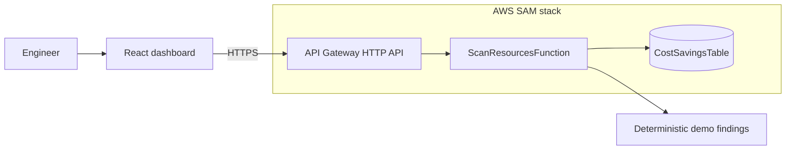

# CloudSaver

[](https://github.com/thing64/CloudSaver/actions/workflows/deploy-pages.yml)
[](backend/template.yaml)
[](frontend/src/Dashboard.jsx)

**A serverless FinOps control plane for finding idle AWS infrastructure,
quantifying avoidable spend, and recording remediation actions.**

[View the interactive portfolio demo →](https://thing64.github.io/CloudSaver/)

> The public preview uses deterministic sample infrastructure and simulates
> remediation in the browser. It is safe to explore and resets on refresh. The
> repository also contains the complete API Gateway, Lambda, and DynamoDB
> implementation used by a deployed environment.

## What it demonstrates

- A responsive FinOps dashboard built with React, Tailwind CSS, and Recharts
- Cost aggregation by service, active-resource filtering, and search
- Optimistic-feeling remediation UX with loading, success, and error states
- A Node.js 20 Lambda router for `GET /resources` and
  `POST /resources/terminate`
- DynamoDB pagination, validation, structured errors, encryption, and
  point-in-time recovery
- Infrastructure as code with AWS SAM, API throttling, CORS, X-Ray, and
  retained logs
- Automated GitHub Pages builds for a zero-credential portfolio preview

## Architecture



```text
frontend/  React 19 · Vite · Tailwind CSS · Recharts · Lucide
backend/   AWS SAM · API Gateway · Lambda · DynamoDB · AWS SDK v3
```

The Lambda intentionally has DynamoDB permissions only. The terminate endpoint
updates CloudSaver's finding state; it does not receive broad permissions to
delete AWS infrastructure. Real destructive actions should use a separate
approval workflow and service-specific least-privilege roles.

## Run locally

Requirements: Node.js 20 or newer and, for backend emulation, AWS SAM CLI.

```bash
git clone https://github.com/thing64/CloudSaver.git
cd CloudSaver/frontend
npm install
cp .env.example .env.local
npm run dev
```

Set `VITE_API_BASE_URL` in `.env.local` to the backend stack's `ApiUrl` output.
Set `VITE_STATIC_DEMO=true` to run the browser-only portfolio experience.

Validate both applications:

```bash
cd frontend && npm ci && npm run build
cd ../backend && npm ci && npm test
sam validate --lint --template template.yaml
```

## Deploy

### Public portfolio preview

The workflow in `.github/workflows/deploy-pages.yml` builds the safe static demo
after every push to `main`.

For a new repository, enable it once in **GitHub → Settings → Pages → Build and
deployment → Source: GitHub Actions**. The published URL is:

```text
https://thing64.github.io/CloudSaver/
```

### AWS backend

```bash
cd backend
sam build
sam deploy --guided \
  --parameter-overrides AllowedOrigin=https://thing64.github.io
```

For production, set `VITE_STATIC_DEMO=false` and `VITE_DEMO_MODE=false`,
configure `VITE_API_BASE_URL`, add an API Gateway authorizer, and put destructive
cloud operations behind explicit approvals.
